# 🚀 Thiết kế, triển khai hệ thống đo lường và giám sát thông số môi trường — Mô tả dự án

Dự án này gồm:
- ESP32 thu thập dữ liệu (nhiệt độ, độ ẩm, nồng độ bụi) sau đó gửi lên server và màn hình LCD
- Server Node.js nhận dữ liệu từ ESP32 qua HTTP, thực hiện lưu trữ dữ liệu vào CSDL MySQL, đồng thời thực hiện vẽ biểu đồ khi các thông số thay đổi, hiển thị lịch sử trên trình duyệt Web
- Trước khi vào thì cần đăng ký tài khoản người dùng, Web sẽ giúp người dùng quản lý được những khu vực đã lắp đặt thiết bị để theo dõi sự thay đổi của nhiệt độ, độ ẩm và nồng độ bụi trong môi trường 
- Chú ý: IP điền để thêm thiết bị là IP của ESP32, khi truy cập vào mỗi đường mạng khác nhau IP sẽ thay đổi random

## 📚 Hướng dẫn để chạy dự án
### 1️⃣ Sau khi tải dự án về sẽ có 2 folder

---

### 2️⃣ "cd" vào folder Esp32 thực hiện debug sau đó upload vào esp32

### 3️⃣ "cd" vào folder Web để chạy Server Web
- Thực hiện: 
```
node sync.js
```
kết quả phải là `Database synced`
- Sau đó thực hiện:
```
node app.js
```
để bắt đầu chạy dự án, copy link: `http://localhost:3001/login` dán vào trình duyệt để trải nghiệm

## 📸 Demo các tính năng

### Đăng nhập, đăng ký
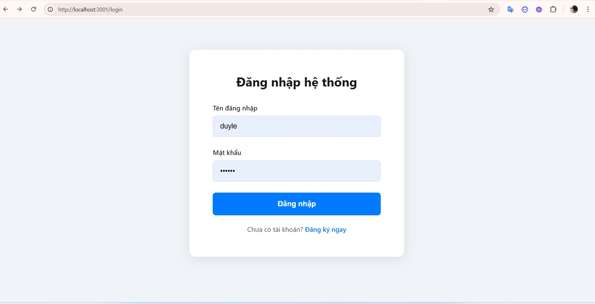
---
### thiếp lập các khu vực đo, giám sát
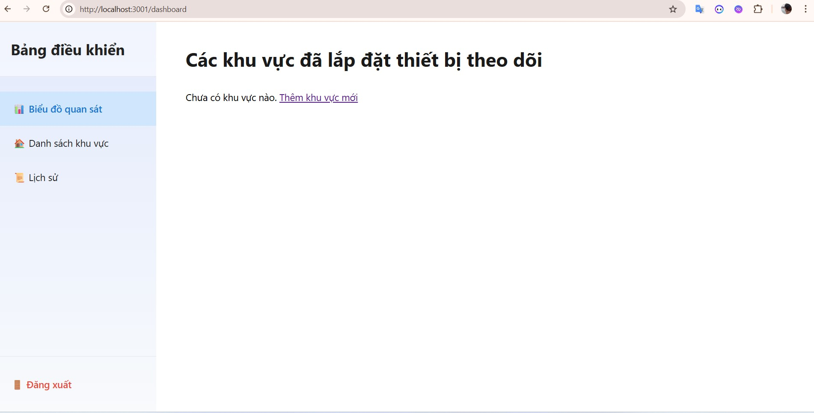
---

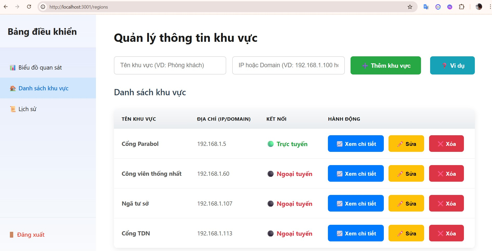
---

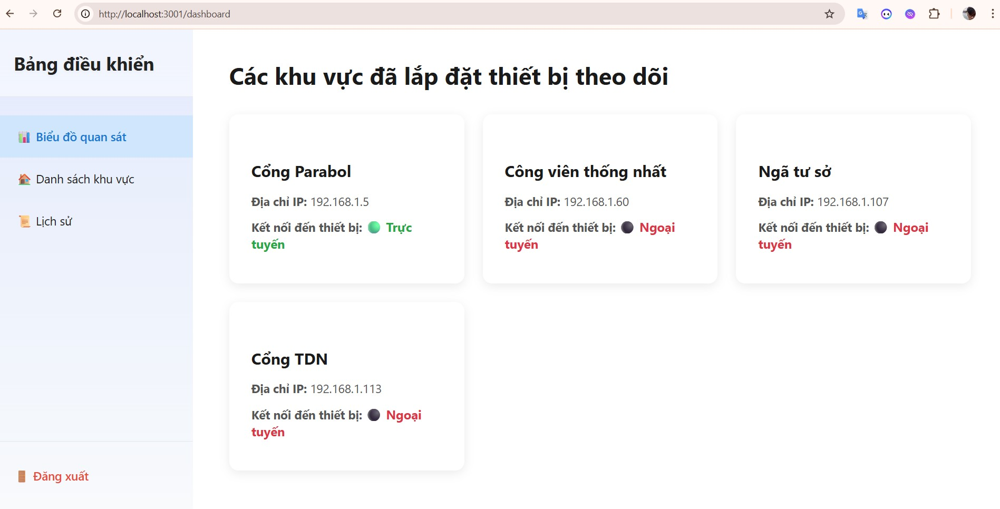
---

### Giám sát các thông số đã được vẽ thành biểu đồ
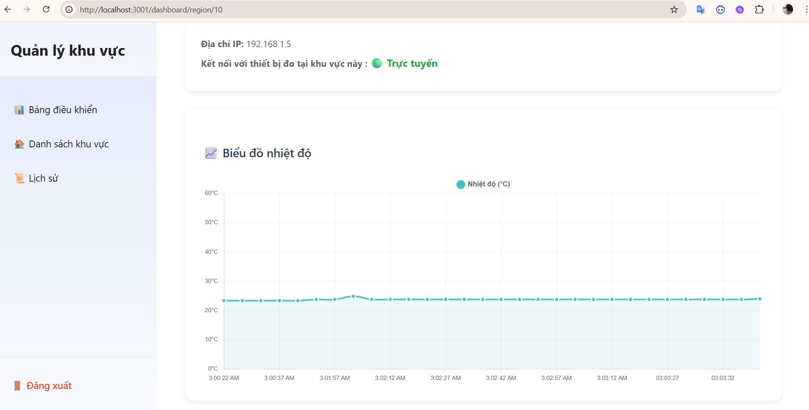
---

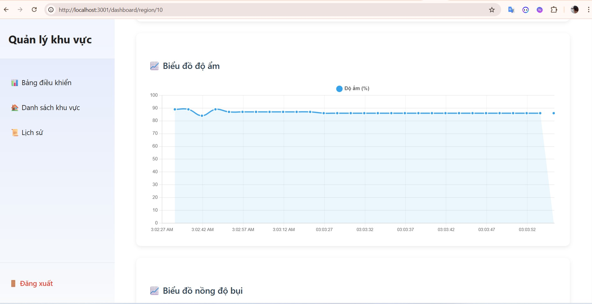
---

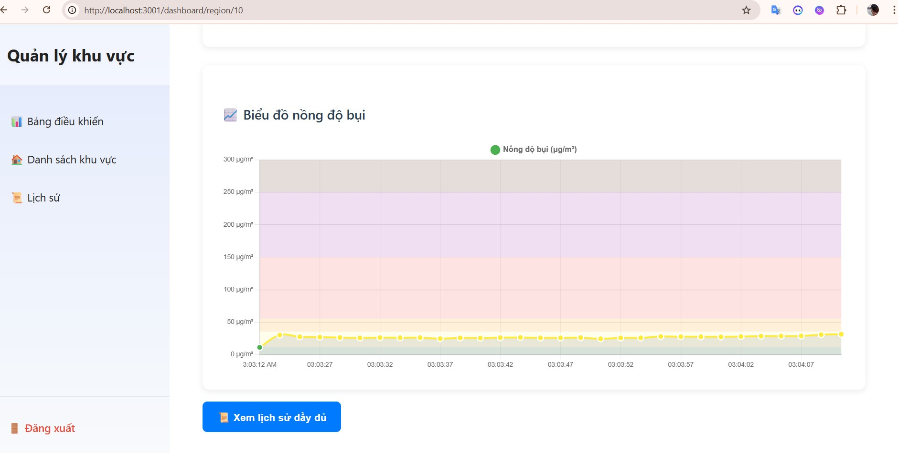
---

### Xem lại lịch sử đã ghi nhận của từng khu vực
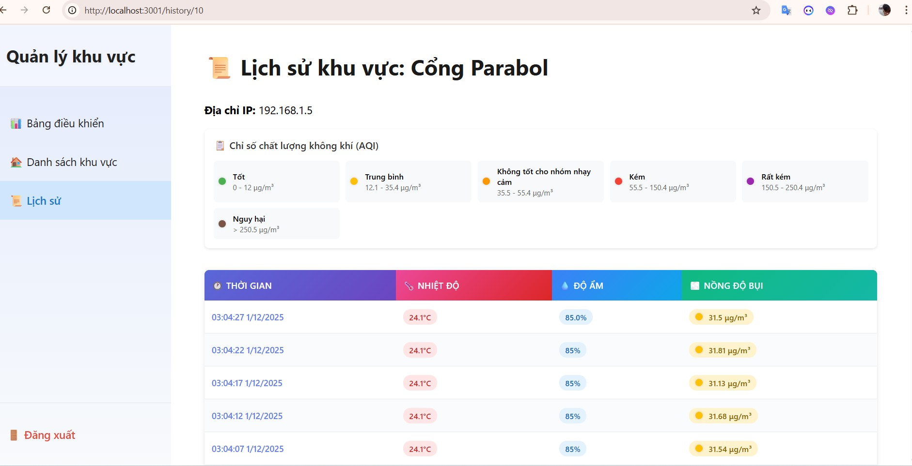
---

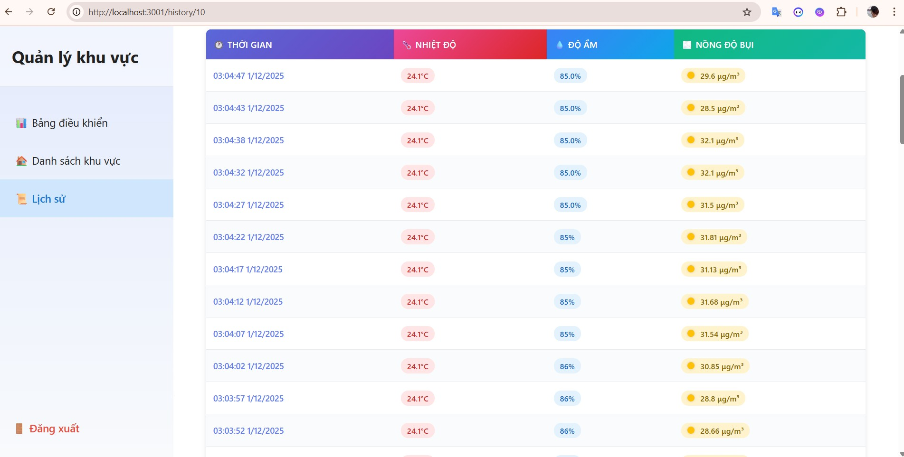
---

### Lưu vào cơ sở dữ liệu
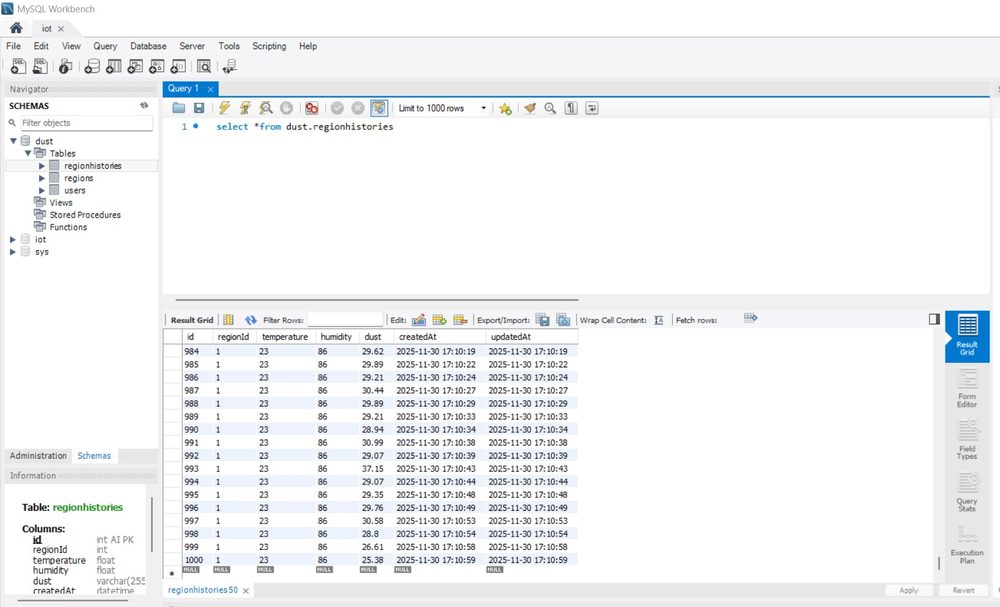
---

### Mạch phần cứng đã nối dây
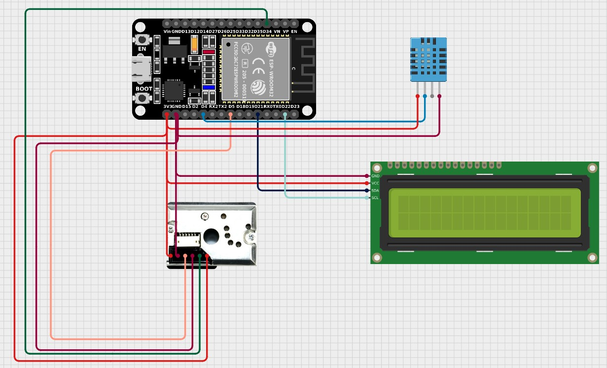
---

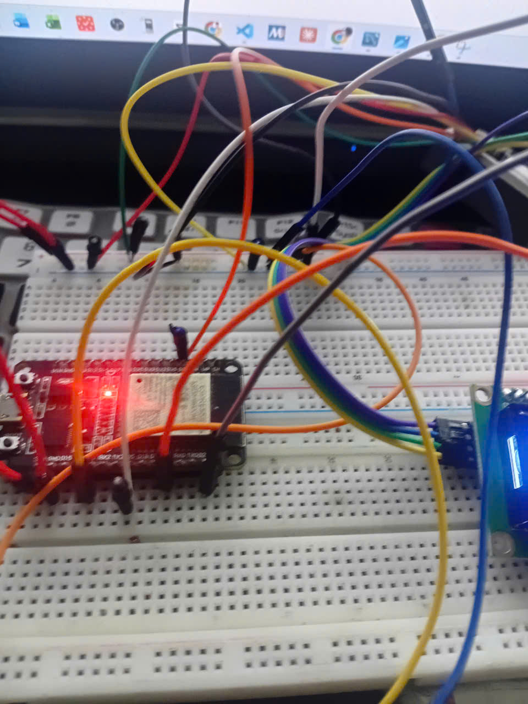
---

### Màn hình LCD hiển thị
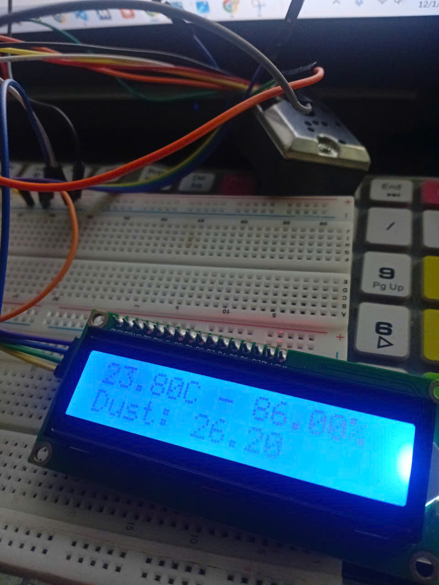
---

## 🏗️Kiến trúc hệ thống
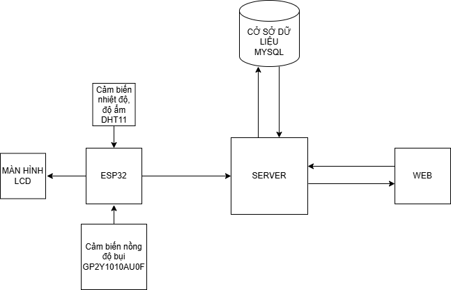
---

## 🧩 Công nghệ sử dụng

### **Firmware ESP32**
- C++ (Arduino Framework)
- WiFi / HTTP Server
- JSON serialization

### **Backend**
- Node.js + Express (cần cài vào VSCODE trước)
- Sequelize ORM (MySQL)

### **Frontend**
- HTML / CSS / JS

### **IDE**
- VSCODE
- Với ESP32 cần cài thêm PlatformIO
